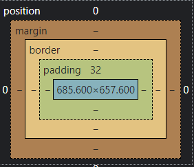

# CSS  
一个Web网页中除了HTML文档，绝大多数也有CSS文档。HTML是决定页面内的具体内容，而CSS决定这些内容的样式。一个元素如何呈现在页面上，包括位置、大小、颜色、背景、透明度等等。  
* CSS修饰的是页面元素中的style属性。属性是您希望设置的样式属性。每个属性有一个值。属性和值被冒号分开。  
  * id选择器 id选择器可以选定标有特定id的元素，对其进行操作。在一篇HTML文档中id是具有唯一标识性的，也就是一个id只能有一个，不能重复。  
  * class选择器 class选择器是选定一组标有同一个class的元素。与id相反，可以为多个元素标识同一个class。
* CSS生效方式   
  * 外部样式表 在一个HTML文档中添加如下一段话:  
  `<link rel="stylesheet" type="text/css" href="mycss.css">`    
  并在同一目录下创建mycss.css的文件，在这个文件中使用id选择器和class选择器对html中的内容进行修饰。
  * 内部样式表 将样式直接放到HTML文档中，称为内部样式表。
  * 内联样式 内联样式就是直接将CSS写到要应用的元素中，如  
  `<label style="color:red">内联样式</label>`  
* CSS背景  
  * background-color 定义了元素的背景颜色。  
  CSS中，颜色值通常以以下方式定义:  
  十六进制 - 如："#ff0000"  
  RGB - 如："rgb(255,0,0)"  
  颜色名称 - 如："red"
  * background-image 描述了元素的背景图像。默认情况下，背景图像进行平铺重复显示，以覆盖整个元素实体。  
  `body {background-image:url('');}`.  
  * background-image 设置背景图片水平或垂直平铺。  
  默认情况下，该属性会在页面的水平或者垂直方向平铺。  
  `background-repeat:repeat-x;`  
  这样就能让图片水平平铺。
* 盒子模型   
所有HTML元素可以看作盒子，在CSS中，"box model"这一术语是用来设计和布局时使用。
CSS盒模型本质上是一个盒子，封装周围的HTML元素，它包括：边距，边框，填充，和实际内容。
盒模型允许我们在其它元素和周围元素边框之间的空间放置元素。  
下面的图片说明了盒子模型  
  
Margin(外边距) - 清除边框外的区域，外边距是透明的。    
Border(边框) - 围绕在内边距和内容外的边框。  
Padding(内边距) - 清除内容周围的区域，内边距是透明的。  
Content(内容) - 盒子的内容，显示文本和图像。    
* 定位  
定位(position)对元素进行定位，它有静态(static)、相对(relative)、固定(fixed)、绝对(absolute)  
  * static HTML 元素的默认值，即没有定位，遵循正常的文档流对象。
静态定位的元素不会受到 top, bottom, left, right影响。
  * relative 相对定位元素的定位是相对其正常位置。移动相对定位元素，但它原本所占的空间不会改变。
  * fixed 元素的位置相对于浏览器窗口是固定位置。即使窗口是滚动的它也不会移动。
  * absolute 绝对定位的元素的位置相对于最近的已定位父元素，如果元素没有已定位的父元素，那么它的位置相对于\<body>。
* 浮动  
CSS 的 Float（浮动），会使元素向左或向右移动，其周围的元素也会重新排列。Float（浮动），往往是用于图像，但它在布局时一样非常有用。  
* 不透明度  
可以用opacity对任何元素设置不透明度。值在[0.0-1.0]之间，值越低，透明度越高。透明度常用于图片当中。